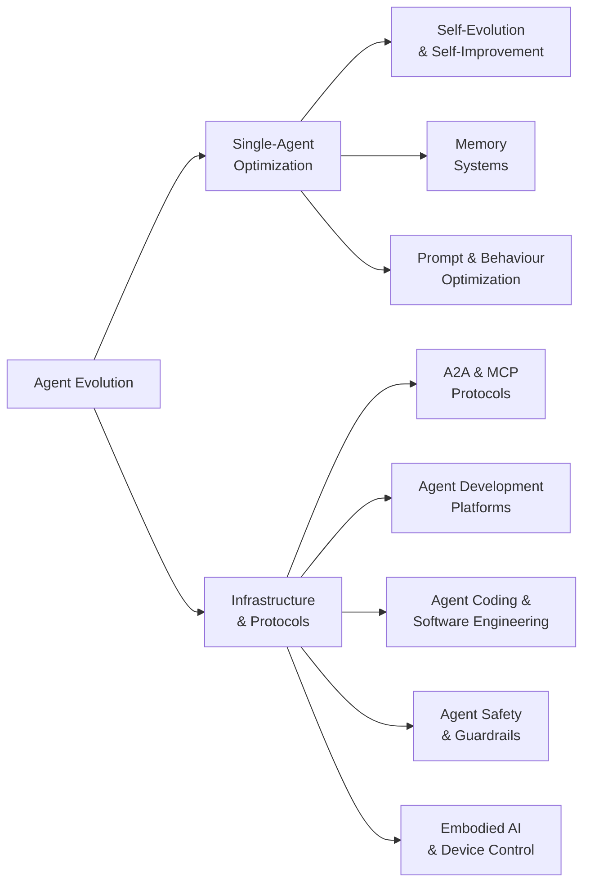

# Awesome Agent Evolution 

> AI Agent self-evolution, memory systems, autonomous self-improvement, and the infrastructure that powers them.

## Contents

- [Taxonomy](#taxonomy)
- [Agent Evolution and Self-Improvement](#agent-evolution-and-self-improvement)
- [Memory Systems](#memory-systems)
- [Agent-to-Agent Protocols](#agent-to-agent-protocols)
- [Agent Development Platforms](#agent-development-platforms)
- [Agent Coding and Software Engineering](#agent-coding-and-software-engineering)
- [Multi-Agent Frameworks](#multi-agent-frameworks)
- [Prompt and Behaviour Optimization](#prompt-and-behaviour-optimization)
- [Agent Safety and Guardrails](#agent-safety-and-guardrails)
- [Embodied AI](#embodied-ai)
- [Key Research Papers](#key-research-papers)
- [Benchmarks and Evaluation](#benchmarks-and-evaluation)
- [Community and Knowledge](#community-and-knowledge)

## Taxonomy

## Agent Evolution and Self-Improvement

Projects focused on enabling AI agents to evolve, learn, and improve autonomously.

<!-- AUTOGEN:evolution -->
- [**Eliza**](https://github.com/elizaOS/eliza#readme) - Autonomous agents for everyone. A framework for creating and deploying AI agents that evolve over time. by [@elizaOS](https://github.com/elizaOS) (19,301 stars)
- [**Agent Zero**](https://github.com/agent0ai/agent-zero#readme) - General-purpose AI agent framework that learns and evolves through interaction. by [@agent0ai](https://github.com/agent0ai) (19,128 stars)
- [**SuperAGI**](https://github.com/TransformerOptimus/SuperAGI#readme) - A dev-first open source autonomous AI agent framework. Build, manage and run self-improving autonomous agents. by [@TransformerOptimus](https://github.com/TransformerOptimus) (17,678 stars)
- [**evolver**](https://github.com/EvoMap/evolver#readme) - The GEP-powered self-evolution engine for AI agents. Genome Evolution Protocol enables agents to evolve autonomously via mutation and selection. by [@EvoMap](https://github.com/EvoMap) (9,074 stars)
- [**OpenEvolve**](https://github.com/algorithmicsuperintelligence/openevolve#readme) - Open-source evolutionary coding agent inspired by AlphaEvolve. Evolves code solutions through LLM-driven mutation and selection. by [@algorithmicsuperintelligence](https://github.com/algorithmicsuperintelligence) (7,339 stars)
- [**Agents (aiwaves)**](https://github.com/aiwaves-cn/agents#readme) - An open-source framework for data-centric, self-evolving autonomous language agents. by [@aiwaves-cn](https://github.com/aiwaves-cn) (5,960 stars)
- [**EvoAgentX**](https://github.com/ANative-Lab/EvoAgentX#readme) - Automated framework for evolving agentic workflows. Optimizes agent prompts, tools, and pipelines via evolutionary algorithms. by [@ANative-Lab](https://github.com/ANative-Lab) (3,316 stars)
- [**HyperAgents**](https://github.com/facebookresearch/HyperAgents#readme) - Self-referential self-improving agents by Meta. DGM-Hyperagents add an optimization layer so agents edit their own improvement process. by [@facebookresearch](https://github.com/facebookresearch) (2,719 stars)
- [**SIA**](https://github.com/hexo-ai/sia#readme) - Self-improving AI framework that autonomously optimizes the performance of any AI system through iterative evaluation and refinement. by [@hexo-ai](https://github.com/hexo-ai) (2,146 stars)
- [**Orkas**](https://github.com/Orkas-AI/Orkas#readme) - Local-first multi-agent desktop application whose specialist agents improve through reflection and crystallize successful approaches into private reusable skills. by [@Orkas-AI](https://github.com/Orkas-AI) (1,834 stars)
- [**Ouroboros**](https://github.com/razzant/ouroboros#readme) - Self-creating AI agent that writes its own code and evolves autonomously. Completed 30+ evolution cycles in first 24 hours with zero human intervention. by [@razzant](https://github.com/razzant) (1,283 stars)
- [**Agent0**](https://github.com/aiming-lab/Agent0#readme) - Self-evolving agent framework from UNC/Salesforce/Stanford. Improves without human-curated datasets via curriculum and executor agent competition. by [@aiming-lab](https://github.com/aiming-lab) (1,258 stars)
- [**agent-qa**](https://github.com/vostride/agent-qa#readme) - Self-improving QA agent for natural-language web and mobile tests, using persistent run memory to adapt to UI changes and catch regressions. Source-available under FSL-1.1-ALv2: use is permitted except to provide a competing commercial product or service, and each release converts to Apache-2.0 after two years. by [@vostride](https://github.com/vostride) (904 stars)
- [**Reef**](https://github.com/Human-Agent-Society/reef#readme) - Continual learning infra for self-improving agents. Serves agent traffic, turns matched feedback into model-weight or harness updates, and publishes accepted updates as versioned artifacts. by [@Human-Agent-Society](https://github.com/Human-Agent-Society) (796 stars)
- [**A-Evolve**](https://github.com/A-EVO-Lab/a-evolve#readme) - The PyTorch for Agentic AI. Open-source infrastructure that evolves any agent across any domain with zero human intervention. #1 on MCP-Atlas (79.4%). by [@A-EVO-Lab](https://github.com/A-EVO-Lab) (776 stars)
- [**OpenProgram**](https://github.com/Fzkuji/OpenProgram#readme) - Self-programming AI agent framework whose agents create, run, and refine their own workflows while the runtime manages models, tools, memory, context, and multi-agent collaboration. by [@Fzkuji](https://github.com/Fzkuji) (422 stars)
- [**SEAgent**](https://github.com/SunzeY/SEAgent#readme) - Self-Evolving Computer Use Agent with Autonomous Learning from Experience. by [@SunzeY](https://github.com/SunzeY) (262 stars)
<!-- /AUTOGEN:evolution -->

## Memory Systems

Vector, graph, episodic, and hybrid memory architectures for persistent agent cognition.

<!-- AUTOGEN:memory -->
- [**Mem0**](https://github.com/mem0ai/mem0#readme) - Production-ready AI agent memory with scalable long-term memory. 26% improvement over baseline on LOCOMO benchmark with 91% latency reduction. by [@mem0ai](https://github.com/mem0ai) (64,952 stars)
- [**Cognee**](https://github.com/topoteretes/cognee#readme) - Knowledge engine for AI agent memory. Build and query knowledge graphs from unstructured data in 6 lines of code. by [@topoteretes](https://github.com/topoteretes) (30,605 stars)
- [**agentmemory**](https://github.com/rohitg00/agentmemory#readme) - Persistent, benchmark-tuned memory for coding agents (Claude Code, Cursor, Copilot CLI, Codex, and any MCP client). Remembers context across sessions so you stop re-explaining. by [@rohitg00](https://github.com/rohitg00) (28,189 stars)
- [**TencentDB Agent Memory**](https://github.com/TencentCloud/TencentDB-Agent-Memory#readme) - Fully local long-term memory for AI agents via a four-tier progressive storage architecture, from Tencent Cloud. by [@TencentCloud](https://github.com/TencentCloud) (26,200 stars)
- [**Letta**](https://github.com/letta-ai/letta#readme) - Platform for building stateful agents with advanced self-editing memory. Formerly MemGPT. by [@letta-ai](https://github.com/letta-ai) (24,668 stars)
- [**Memvid**](https://github.com/memvid/memvid#readme) - Single-file memory layer for AI Agents in Rust. +35% SOTA on LoCoMo with ultra-low latency (0.025ms P50). by [@memvid](https://github.com/memvid) (16,528 stars)
- [**memU**](https://github.com/NevaMind-AI/memU#readme) - Memory system for 24/7 proactive agents. Persistent memory across sessions and platforms. by [@NevaMind-AI](https://github.com/NevaMind-AI) (14,395 stars)
- [**EverMemOS**](https://github.com/EverMind-AI/EverOS#readme) - Long-term memory for 24/7 AI agents across LLMs and platforms. by [@EverMind-AI](https://github.com/EverMind-AI) (12,803 stars)
- [**holaOS**](https://github.com/holaboss-ai/holaOS#readme) - Agent environment for long-horizon work, continuity, and self-evolution. by [@holaboss-ai](https://github.com/holaboss-ai) (11,189 stars)
- [**ChatLab**](https://github.com/ChatLab/ChatLab#readme) - Rediscover your social memories with local, AI-powered analysis. 本地化的聊天记录分析工具，通过 AI Agent 回顾你的社交记忆。. by [@ChatLab](https://github.com/ChatLab) (7,331 stars)
- [**honcho**](https://github.com/plastic-labs/honcho#readme) - Memory library for building stateful agents with user context management. by [@plastic-labs](https://github.com/plastic-labs) (7,074 stars)
- [**memgraph**](https://github.com/memgraph/memgraph#readme) - High-performance open-source in-memory graph database for GraphRAG, AI memory, agentic AI, and real-time graph analytics. Cypher-compatible, built in C++. by [@memgraph](https://github.com/memgraph) (4,455 stars)
- [**Acontext**](https://github.com/memodb-io/Acontext#readme) - Open-source skill memory layer for AI agents. Automatically captures learnings from agent runs and stores them as reusable skill files. by [@memodb-io](https://github.com/memodb-io) (3,687 stars)
- [**ReMe**](https://github.com/agentscope-ai/ReMe#readme) - Memory management kit for agents. File-based and vector-based memory systems. SOTA on LoCoMo and HaluMem benchmarks. by [@agentscope-ai](https://github.com/agentscope-ai) (3,435 stars)
- [**MemMachine**](https://github.com/MemMachine/MemMachine#readme) - Universal memory layer for AI agents. Episodic (graph-based), profile (SQL), and working memory with scalable storage and retrieval. by [@MemMachine](https://github.com/MemMachine) (3,217 stars)
- [**datachain**](https://github.com/datachain-ai/datachain#readme) - Operational data context layer for AI agents providing typed and versioned datasets over multimodal content. by [@datachain-ai](https://github.com/datachain-ai) (2,819 stars)
- [**nocturne_memory**](https://github.com/Dataojitori/nocturne_memory#readme) - Lightweight, rollbackable Long-Term Memory Server for MCP Agents with graph-like structured memory. by [@Dataojitori](https://github.com/Dataojitori) (1,346 stars)
- [**Mem9**](https://github.com/mem9-ai/mem9#readme) - Unlimited persistent memory layer for AI agents. Cloud-synced memory across sessions and tools. by [@mem9-ai](https://github.com/mem9-ai) (1,208 stars)
- [**Awesome-AI-Memory**](https://github.com/IAAR-Shanghai/Awesome-AI-Memory#readme) - Curated knowledge base on AI memory for LLMs and agents, covering long-term memory, reasoning, retrieval, and system design. by [@IAAR-Shanghai](https://github.com/IAAR-Shanghai) (1,208 stars)
- [**Awesome-Agent-Memory**](https://github.com/TeleAI-UAGI/Awesome-Agent-Memory#readme) - Curated systems, benchmarks, and papers on memory for LLMs/MLLMs -- long-term context, retrieval, and reasoning. by [@TeleAI-UAGI](https://github.com/TeleAI-UAGI) (629 stars)
- [**MemSkill**](https://github.com/ViktorAxelsen/MemSkill#readme) - Learning and evolving memory skills for self-evolving agents. Meta-memory that determines what to extract, remember, and forget. by [@ViktorAxelsen](https://github.com/ViktorAxelsen) (572 stars)
- [**TeleMem**](https://github.com/TeleAI-UAGI/telemem#readme) - High-performance drop-in Mem0 replacement. 19% higher accuracy, 43% fewer tokens, and 2.1x speedup via narrative dynamic extraction. by [@TeleAI-UAGI](https://github.com/TeleAI-UAGI) (489 stars)
<!-- /AUTOGEN:memory -->

## Agent-to-Agent Protocols

Standards and protocols for inter-agent communication and interoperability.

<!-- AUTOGEN:protocols -->
- [**Google A2A**](https://github.com/a2aproject/A2A#readme) - Google's open Agent-to-Agent protocol. Enables agent discovery, secure collaboration, and long-running tasks while preserving agent opacity. by [@a2aproject](https://github.com/a2aproject) (25,696 stars)
- [**mcp-use**](https://github.com/mcp-use/mcp-use#readme) - The fullstack MCP framework to develop MCP Apps for ChatGPT/Claude and MCP Servers for AI Agents. by [@mcp-use](https://github.com/mcp-use) (10,595 stars)
- [**openagent**](https://github.com/the-open-agent/openagent#readme) - Enterprise AI platform with MCP and A2A protocol management, knowledge base, and admin interface. by [@the-open-agent](https://github.com/the-open-agent) (5,608 stars)
- [**ViteMCP**](https://github.com/punkpeye/fastmcp#readme) - A TypeScript framework for building MCP servers. by [@punkpeye](https://github.com/punkpeye) (3,262 stars)
- [**arcade-mcp**](https://github.com/ArcadeAI/arcade-mcp#readme) - MCP server framework and tool-development library for building custom agent capabilities and authenticated tool calls. by [@ArcadeAI](https://github.com/ArcadeAI) (1,022 stars)
- [**A2A x402**](https://github.com/google-agentic-commerce/a2a-x402#readme) - A2A protocol extension adding x402 on-chain payments, letting agents monetize services over Agent-to-Agent calls. by [@google-agentic-commerce](https://github.com/google-agentic-commerce) (559 stars)
- [**GEP MCP Server**](https://github.com/EvoMap/gep-mcp-server#readme) - MCP Server for Genome Evolution Protocol. Exposes evolution tools to Claude Desktop, Cursor, and any MCP client. by [@EvoMap](https://github.com/EvoMap) (6 stars)
<!-- /AUTOGEN:protocols -->

## Agent Development Platforms

Platforms and tools for building, deploying, and managing AI agents.

<!-- AUTOGEN:platforms -->
- [**dify**](https://github.com/langgenius/dify#readme) - Production-ready platform for building agentic AI workflows with visual orchestration. by [@langgenius](https://github.com/langgenius) (155,124 stars)
- [**LangChain**](https://github.com/langchain-ai/langchain#readme) - Full-stack agent engineering platform with composable chains, tools, and memory integration. by [@langchain-ai](https://github.com/langchain-ai) (145,983 stars)
- [**OpenHands**](https://github.com/OpenHands/OpenHands#readme) - Open platform for AI software developers as generalist agents. Autonomous coding, debugging, and deployment. by [@OpenHands](https://github.com/OpenHands) (86,970 stars)
- [**CowAgent**](https://github.com/zhayujie/CowAgent#readme) - Super AI assistant based on LLMs with autonomous thinking, task planning, skill creation, and long-term memory. by [@zhayujie](https://github.com/zhayujie) (46,845 stars)
- [**agno**](https://github.com/agno-agi/agno#readme) - Production-ready agent framework that turns agents into deployable services with multi-framework support. by [@agno-agi](https://github.c